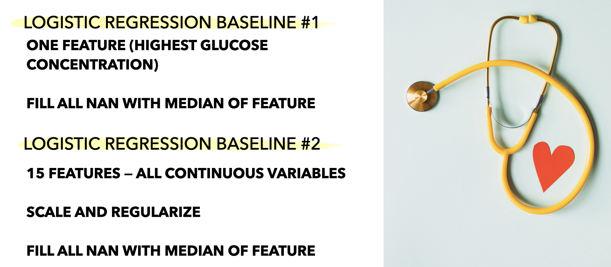
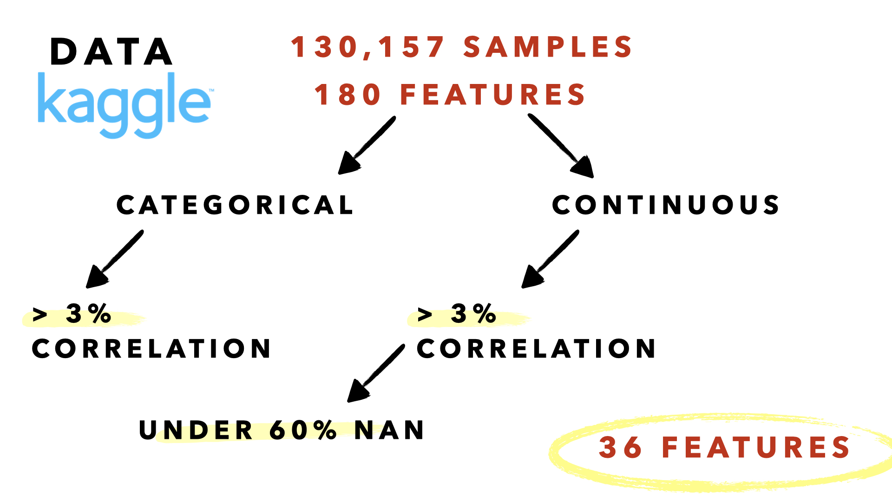
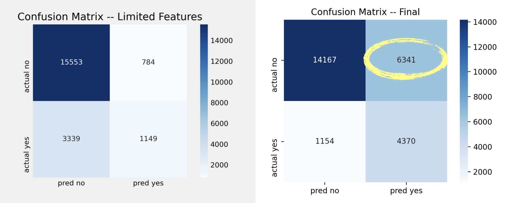

# **IDENTIFYING DIABETES TO INFORM DECISIONS ABOUT PATIENT CARE**
Leslie Cardone  
May 14, 2021  
Metis: Classification

## ABSTRACT

With hospital overwhelm across the United States during the COVID-19 pandmic, healthcare workers have struggled to treat an overwhelming amount of patients in critical condition. 

"Intensive Care Units (ICUs) often lack verified medical histories for incoming patients. A patient in distress or a patient who is brought in confused or unresponsive may not be able to provide information about chronic conditions such as heart disease, injuries, or diabetes. Medical records may take days to transfer, especially for a patient from another medical provider or system. Knowledge about chronic conditions such as diabetes can inform clinical decisions about patient care and ultimately improve patient outcomes." ([source](https://www.kaggle.com/c/widsdatathon2021/overview/description))

## DATA

This project, inspired by the Women in Data Science Datathon 2021 competition, focuses on the chronic condition of diabetes. The data has been provided by [MIT’s GOSSIS](https://gossis.mit.edu/) (Global Open Source Severity of Illness Score) initiative. (Other credits: [West Big Data](https://westbigdatahub.org/) Innovation Hub and [WiDS Datathon Committee](https://www.widsconference.org/committee-2021.html).)

There are 130,157 samples.

There are 180 feature columns consisting of vitals, labs, and various demographic information.

The target is binary.  
1  Has been diagnosed with diabetes  
0  Has not been diagnosed with diabetes

*BASELINE MODEL*

I created two baseline logistic regression models. I selected logistic regression because I believed the probability % for each class could potentially aid doctures further.

The first model only used the feature with the highest correlation with the target (highest glucose concentration). The second model used the top 15 features most correlated with the target.

*FEATURE SELECTION*  

Features were selected for use in the final model by their correlation and percentage of NA values. I dropped features with more than 60% NA values and less than 3% and greater than -3% correlation with the target. Many of the features did not show much correlation.

*HANDLING MISSING VALUES*

I trained a simple KNNClassifer (3 neighbors) on columns with no missing values (excluding target). I imputed NA values for the columns mentioned aove (36 in total) with the KNNClassifer prediction.  

*HYPERPARAMETER TUNING*  

I set 20% of my data aside for my hold out set. The remaining 80% I divided into 80/20 train/validate. I performed a GridSearchCV to select values for class weights and C, optimizing for F1 and Recall. I selected my regularization method by validating manually.

## FINDINGS

| Metric               | Baseline 1   | Baseline 2  |  Final   |
|----------------------|--------------|-------------|----------|
| Accuracy             | 79.8%        | 80.2%       | 71.2%    |
| Precision            | 59.1%        | 59.4%       | 40.8%    |
| Recall               | 21%          | 26%         | 79%      |
| F1                   | 31%          | 36%         | 54%      |

Class weights had the largest impact on model performance. Although I was able to increase the recall score percentage by 58%, it was difficult to keep precision high.

As seen in the confusion matrixes below, the final model is able to accurately identify more patients that had previously been diagnosed with diabetes compared to Baseline 2. 

However, in doing so, we start to incorrectly identify patients who had never been diagnosed with diabetes as having been diagnosed. 

## ALGORITHMS/TOOLS

*LIBRARIES*
- Numpy and Pandas for data manipulation
- sklearn.linear_model for logistic regression
- sklearn.metrics for scoring
- sklearn.preprocessing for scaling
- matplotlib for visualizations
- Tableau for visualizations

## FUTURE

I plan to compare the following models on this data set:
- Random Forest
- Gaussian Naive Bayes
- Bernoulli Naive Bayes
- XGBoost

I would also look at the ROC curves for all five models (including my logistic regression model).

## MISC

*FEATURE LIST:* ethnicity, gender, hospital_admit_source, icu_admit_source, icu_stay_type, icu_type, d1_sysbp_max, d1_diasbp_min, d1_sysbp_noninvasive_max, d1_diasbp_noninvasive_min, weight, bmi, age, h1_sysbp_max, h1_diasbp_min, h1_diasbp_max, d1_glucose_min, d1_glucose_max, h1_sysbp_noninvasive_max, h1_diasbp_noninvasive_min, h1_diasbp_noninvasive_max, d1_potassium_min, d1_potassium_max, d1_creatinine_min, d1_creatinine_max, d1_sodium_min, d1_bun_min, d1_bun_max, glucose_apache, d1_hematocrit_max, d1_hematocrit_min, d1_hemaglobin_min, d1_hemaglobin_max, d1_calcium_max, d1_hco3_min, sodium_apache, creatinine_apache, bun_apache, hematocrit_apache, h1_glucose_min, h1_glucose_max, arf_apache

