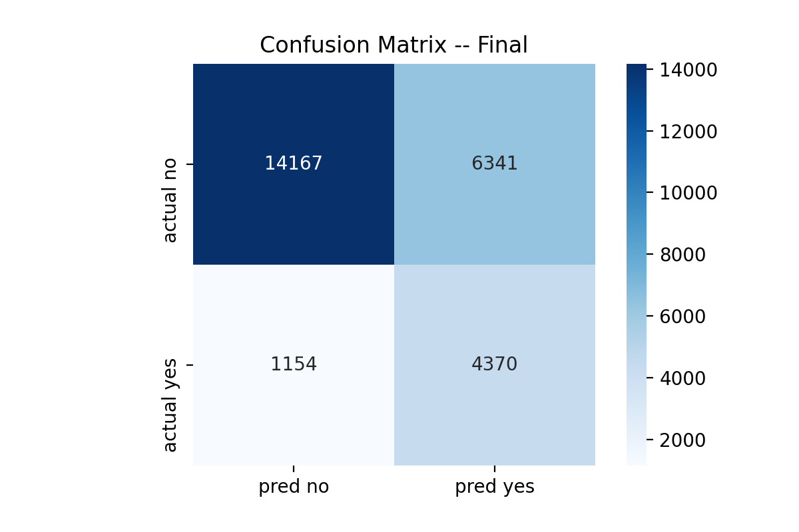

# **PREDICTING DIABETES IN ICU PATIENTS**
Leslie Cardone  
May 14, 2021  
Metis: Classification

## ABSTRACT

With hospital overwhelm across the United States during the COVID-19 pandmic, healthcare workers have struggled to treat an overwhelming amount of patients in critical condition. 

"Intensive Care Units (ICUs) often lack verified medical histories for incoming patients. A patient in distress or a patient who is brought in confused or unresponsive may not be able to provide information about chronic conditions such as heart disease, injuries, or diabetes. Medical records may take days to transfer, especially for a patient from another medical provider or system. Knowledge about chronic conditions such as diabetes can inform clinical decisions about patient care and ultimately improve patient outcomes." ([source](https://www.kaggle.com/c/widsdatathon2021/overview/description))

## DATA

This project, inspired by the Women in Data Science Datathon 2021 competition, focuses on the chronic condition of diabetes. The data has been provided by [MIT’s GOSSIS (Global Open Source Severity of Illness Score)](https://gossis.mit.edu/) initiative. (Other credits: [West Big Data Innovation Hub](https://westbigdatahub.org/) and [WiDS Datathon Committee](https://www.widsconference.org/committee-2021.html).)

There are 130,157 samples in the training data that I will break into a training, validation, and hold-out set.
There are 180 feature columns consisting of vitals, labs, and various demographic information.

180 features were narrowed down to 36 for the final model (for list see variable.md in data-eda-modeling directory) 

The target is binary.  
1  Has been diagnosed with diabetes  
0  Has not been diagnosed with diabetes

## DESIGN

*FEATURE SELECTION*  
Features were selected for use in the final model by their correlation and percentage of NA values. I dropped features with more than 60% NA values.  

I trained a simple KNNClassifer (3 neighbors) on columns with no missing values (excluding target). I imputed NA values for the 36 above columns with the KNNClassifer prediction.  

*HYPERPARAMETER TUNING*  
I set 20% of my data aside for my hold out set. The remaining 80% I divided into 80/20 train/validate. I performed a GridSearchCV to select values for class weights and C, optimizing for F1 and Recall. I selected my regularization method by validating manually.

## ALGORITHMS/TOOLS

*LIBRARIES*
- Numpy and Pandas for data manipulation
- sklearn.linear_model for logistic regression
- sklearn.metrics for scoring
- sklearn.preprocessing for scaling
- matplotlib for visualizations
- Tableau for visualizations

## COMMUNICATION
*VISUALIZATIONS*
1. 10 Feature Confusion Matrix:

2. Final Model Confusion Matrix:

