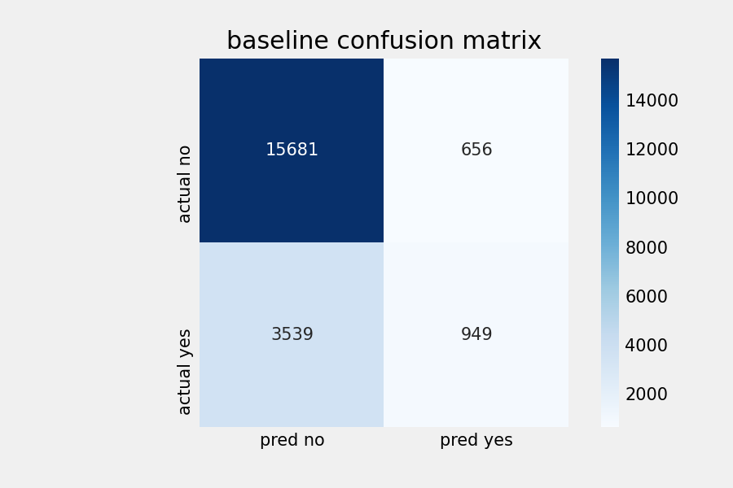
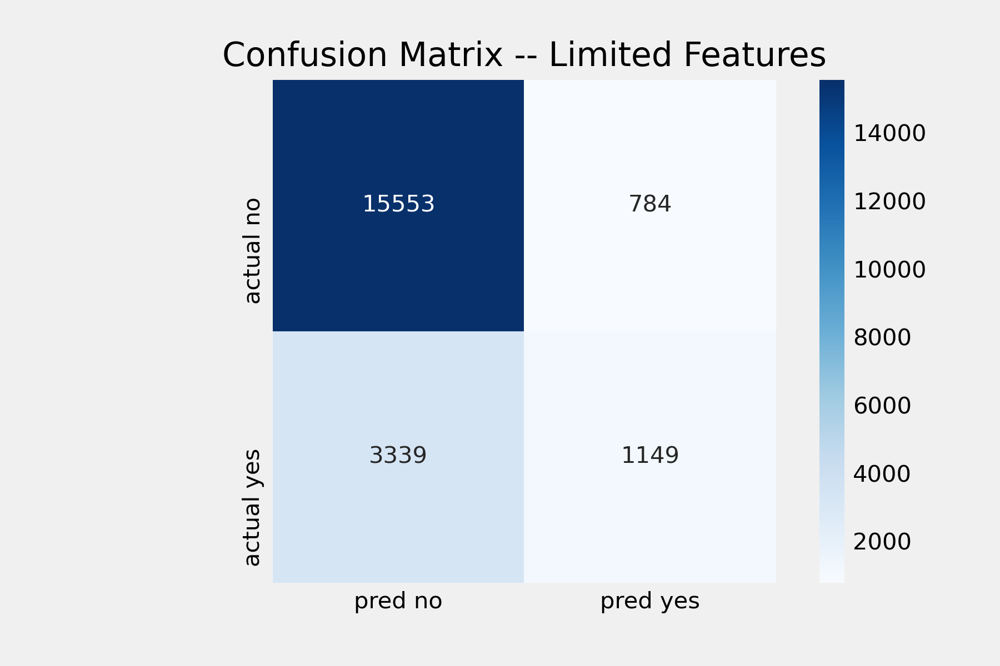

# Logistic Regression Analysis

I trained two Scikit-learn Logistic Regression model. The first was trained on one feature, 'D1 Glucose Max', which was the feature most correlated with the target. The second was trained on the top 10 correlated features. All feature columns are continuous and NAN values were imputed with the median of the column.

The two models have fairly decent accuracy, but as seen in the confusion matrix, have poor recall scores.

## Baseline:

Trained on "Training", Scored on "Validation" data...
"Hold Out" is set aside.

**Accuracy Score:** .798  
**Precision:** 0.5913  
**Recall:** 0.2115  

## Ten Feature

Trained on **scaled** "Training", Scored on "Validation" data ... 
"Hold Out" is set aside.

**Accuracy Score:** .800  
**Precision:** 0.5898  
**Recall:** 0.2438  

## Future
I would also like to fit a Random Forest Classifier and And XGBoost model.

I also plan to:
- address class imbalance
- perform smarter imputation of NAN
- tune hyperparamaters of my models